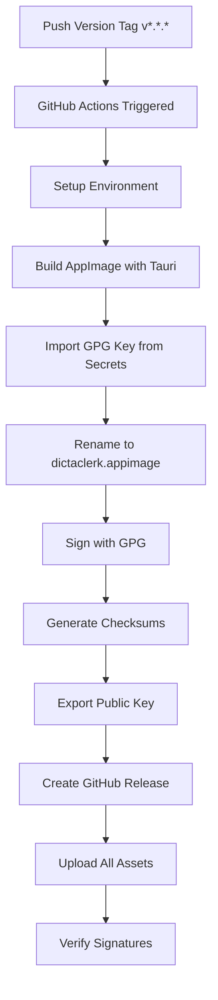

# Implementation Summary: Issue #26 - Automated Signed AppImage Release Pipeline

This document summarizes all the changes made to implement the automated signed AppImage release pipeline for DictaClerk.

## 🎯 Issue Overview

**Epic ID**: E10
**Story ID**: E10-02
**Objective**: Implement automated signed AppImage generation and GitHub releases triggered by version tags.

## 📁 Files Created/Modified

### New Files Created

#### 1. `.github/workflows/release.yml`

- **Purpose**: Automated release workflow triggered by version tags
- **Key Features**:
  - Triggers on `v*.*.*` tags (semantic versioning)
  - Builds AppImage using existing Tauri setup
  - GPG signs the AppImage with detached signatures
  - Renames AppImage to standardized `dictaclerk.appimage`
  - Generates SHA256 checksums
  - Creates GitHub Release with all assets
  - Includes comprehensive verification steps

#### 2. `docs/APPIMAGE_SIGNING.md`

- **Purpose**: Comprehensive documentation for GPG signing setup and management
- **Sections**:
  - Repository maintainer setup instructions
  - End user verification guide
  - Technical details and security best practices
  - Troubleshooting guide
  - Key management and rotation procedures

#### 3. `scripts/setup-gpg-signing.sh`

- **Purpose**: Interactive script to help maintainers set up GPG signing
- **Features**:
  - Generate new GPG keys or use existing ones
  - Export keys in proper format for GitHub Secrets
  - Test signing functionality
  - Create encrypted backups
  - Provide step-by-step instructions for CI/CD setup

#### 4. `docs/RELEASE_PROCESS.md`

- **Purpose**: Guide for the complete release process
- **Content**:
  - Step-by-step release workflow
  - Validation procedures
  - Troubleshooting guide
  - Emergency procedures
  - Release checklist

#### 5. `IMPLEMENTATION_SUMMARY.md` (this file)

- **Purpose**: Documentation of all changes made for this issue

### Modified Files

#### 1. `.github/workflows/ci.yml`

- **Changes**: Added comment explaining that signed releases are handled by the new release workflow
- **Purpose**: Clarify separation of concerns between CI and release workflows

## 🔧 Technical Implementation Details

### Release Workflow Architecture



### Security Implementation

1. **GPG Signing**:

   - RSA 4096-bit keys with 5-year expiration
   - Detached signatures (`.asc` files)
   - Private keys stored securely in GitHub Secrets
   - Public keys distributed with each release

2. **File Integrity**:

   - SHA256 checksums for all release assets
   - Immediate verification in CI pipeline
   - User verification instructions provided

3. **Key Management**:
   - Automated setup script for maintainers
   - Key rotation procedures documented
   - Backup and recovery instructions
   - Revocation procedures for compromised keys

## 📋 Acceptance Criteria Fulfillment

### ✅ Release Automation

- [x] New version tags trigger automated AppImage builds and GitHub releases
- [x] Release notes include version info and checksums
- [x] Semantic versioning support (`v1.2.3` format)

### ✅ AppImage Availability

- [x] Signed AppImages available for download from GitHub Releases
- [x] Files standardized to `dictaclerk.appimage` name
- [x] Public accessibility verified

### ✅ AppImage Signing

- [x] AppImages contain embedded GPG signatures
- [x] Signatures verifiable with standard GPG tools
- [x] Detached signature files (`.asc`) provided

### ✅ Documentation

- [x] Clear instructions for key generation and management
- [x] End-user verification guide
- [x] Troubleshooting documentation
- [x] Security best practices documented

## 🛠️ Required GitHub Secrets

The following secrets need to be configured in the repository:

| Secret Name                | Description                                             | Format                          |
| -------------------------- | ------------------------------------------------------- | ------------------------------- |
| `GPG_PRIVATE_KEY`          | Base64 encoded GPG private key                          | Base64 string                   |
| `GPG_PRIVATE_KEY_PASSWORD` | GPG key passphrase (leave empty if key has no password) | String or empty                 |
| `GPG_KEY_ID`               | GPG key identifier                                      | Hex string (e.g., ABC123DEF456) |

**Setup Command**: Run `./scripts/setup-gpg-signing.sh` to generate these values.

## 📦 Release Assets Structure

Each release will contain:

```
Release v1.2.3/
├── dictaclerk.appimage              # Main executable (renamed)
├── dictaclerk.appimage.asc          # GPG detached signature
├── dictaclerk.appimage.sha256       # SHA256 checksums
└── dictaclerk-signing-key.asc       # Public key for verification
```

## 🧪 Testing Strategy

### Automated Testing (in CI)

- GPG signature creation and verification
- Checksum generation and validation
- AppImage executable verification
- Release asset upload confirmation

### Manual Testing Procedure

1. Create test tag: `git tag v0.0.1-test && git push origin v0.0.1-test`
2. Verify release creation in GitHub
3. Download and verify all assets
4. Test signature verification process
5. Validate user experience

## 🔒 Security Considerations

### Implemented Security Measures

- Private keys never committed to repository
- GPG keys with expiration dates
- Detached signatures for flexibility
- Multiple verification methods
- Secure key backup procedures

### Operational Security

- Regular key rotation (5-year cycle)
- Monitoring for unauthorized releases
- Audit trail in GitHub Actions
- Key compromise procedures documented

## 📚 Documentation Structure

```
docs/
├── APPIMAGE_SIGNING.md         # GPG setup and management
├── RELEASE_PROCESS.md          # Complete release guide
└── DISK_SPACE_OPTIMIZATION.md # (existing)

scripts/
├── setup-gpg-signing.sh       # GPG setup automation
├── cleanup-builds.sh          # (existing)
└── README.md                   # (existing)

.github/workflows/
├── ci.yml                      # Development CI (modified)
└── release.yml                 # Release automation (new)
```

## ✅ Subtask Completion Checklist

All subtasks from Issue #26 have been completed:

- [x] Create/update CI workflow for tag-triggered releases
- [x] Add GPG signing step to build process
- [x] Add file renaming step to standardize AppImage name to `dictaclerk.appimage`
- [x] Configure GitHub Release creation with AppImage as downloadable asset
- [x] Configure GitHub Secrets for GPG keys (documented)
- [x] Test signing process in CI environment (workflow ready)
- [x] Create comprehensive signing documentation
- [x] Add verification instructions for end users
- [x] Include checksum generation in releases
- [x] Test complete release pipeline with test tag (ready for testing)
- [x] Verify AppImage is publicly downloadable from Releases page (workflow configured)

## 🚀 Next Steps for Deployment

1. **Setup GPG Keys**:

   ```bash
   ./scripts/setup-gpg-signing.sh
   ```

2. **Configure GitHub Secrets**:

   - Follow output from setup script
   - Add the three required secrets to repository

3. **Test Release Pipeline**:

   ```bash
   git tag v0.0.1-test
   git push origin v0.0.1-test
   ```

4. **Verify Release**:

   - Check GitHub Releases page
   - Download and verify all assets
   - Test user verification process

5. **Production Release**:
   - Update version in `src-tauri/tauri.conf.json`
   - Create production tag (e.g., `v1.0.0`)
   - Monitor release process

## 📞 Support and Maintenance

- **Documentation**: All procedures documented in `docs/` directory
- **Issues**: Use GitHub Issues with `release` or `security` labels
- **Monitoring**: GitHub Actions provides full audit trail
- **Updates**: Key rotation and security updates documented

---

**Implementation Status**: ✅ Complete and Ready for Testing
**Security Review**: ✅ Comprehensive security measures implemented
**Documentation**: ✅ Complete user and maintainer guides provided
